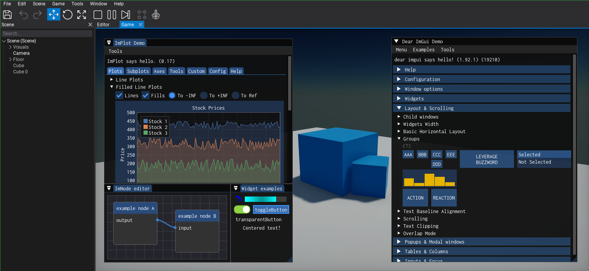

# FlexaImGui

[Dear ImGui](https://github.com/ocornut/imgui) plugin for [Flax Engine](https://github.com/FlaxEngine/FlaxEngine) as a C# first-class citizen, powered by [Hexa.NET.ImGui](https://github.com/HexaEngine/Hexa.NET.ImGui).


## What and why?
The Flax Engine already has an official [Dear ImGui plugin](https://github.com/FlaxEngine/ImGui). However, that plugin is mainly for use on the C++ side, as the C# coverage of the plugin is [severely limited](https://github.com/FlaxEngine/ImGui/blob/master/Source/ImGui/ImGui.cs) compared to Dear ImGui's full feature set. 

In contrast, FlexaImGui is:
 - A true C# citizen; construct immediate mode GUI from any C# script or code using the ``ImGui`` namespace.
 - Feature complete via the latest stable version[^1] of the excellent [Hexa.NET.ImGui](https://github.com/HexaEngine/Hexa.NET.ImGui) wrapper. As such, FlexaImGui also includes:
   - (Nearly[^2]) the same performance allowed by Hexa.NET.ImGui.
   - The [ImGuizmo](https://github.com/CedricGuillemet/ImGuizmo), [ImNodes](https://github.com/Nelarius/imnodes), [ImPlot](https://github.com/epezent/implot), and [ImWidgets](https://github.com/HexaEngine/Hexa.NET.ImGui.Widgets) addons.
   - Full docking support.
   - Custom font support (``.ttf``).


## Installation
1. Close your Flax Editor if you have it open. Clone the repo into ``<game-project>\Plugins\FlexaImGui`` (create the Plugins folder if missing).
2. Reference the plugin in your ``<game-project>.flaxproj`` file:
```
...
"References": [
    {
        "Name": "$(EnginePath)/Flax.flaxproj"
    },
    {
        "Name": "$(ProjectPath)/Plugins/FlexaImGui/FlexaImGui.flaxproj"
    }
]
```
3. Reference FlexaImGui in your game build script (e.g. ``Game.Build.cs``):
```cs
/// <inheritdoc />
public override void Setup(BuildOptions options)
{
    base.Setup(options);

    options.ScriptingAPI.IgnoreMissingDocumentationWarnings = true;

	// Add reference to FlexaImGui
	options.PrivateDependencies.Add("FlexaImGui");
}
```
4. Call the static method ``FlexaImGui.Setup()`` once at the start of your Flax Project's lifetime, ideally in your ``GamePlugin``'s ``Initialize()`` method. If you can't see the ``FlexaImGui`` or ``ImGui`` namespaces, make sure to regenerate your 'scripts project files' (under ``Flax Editor > File``).
5. On each frame update, call ``FlexaImGui.NewFrame()`` before any other ``ImGui`` calls (e.g. ``ImGui.ShowDemoWindow()``). You can do this in a specific script, or inside a method that you've subscribed to the ``Scripting.Update`` event.
6. That's it! Use the ``ImGui`` namespace to build your GUI anywhere that's called during ``OnUpdate()``, and FlexaImGui handles the rest without the need for you to manually call ``ImGui.Render()``.

If you're new to Dear ImGui, I highly recommend [this interactive manual](https://pthom.github.io/imgui_manual_online/manual/imgui_manual.html) for learning how to use it. Don't forget to unlock your mouse (``Screen.CursorLock = CursorLockMode.None;``) in order to interact with ImGui elements. Enjoy immediate GUI in Flax via C#!

## Q&A
#### How do I load and use a custom font?
Add the ``<font-name>.ttf`` file of your choice into the FlexaImGui plugin's content folder (at ``<game-project>\Plugins\FlexaImGui\Content``), then run the following code right after ``FlexaImGui.Setup()``: 
```cs
unsafe
{
	if (FlexaImGui.AddFontFromFileTTF("<font-name>", out ImFont* font, 15))
		ImGui.AddFontDefault(font->ContainerAtlas);
}
```
``Inconsolata-Regular.ttf`` is included by default as an example font. 

⚠️ **Note:** The font will be copied into your game's root folder when your game is built, and loaded from there when not ran from the editor. This solution is a workaround whilst awaiting the ability to embed font files directly into the .NET executable of Flax games.

#### How do I configure the ImGui style?
You can pass in the style you want to use in ``FlexaImGui.Setup()`` via the ``ImGuiStyle`` enum. Supported values are the built-in ``Dark``, ``Light`` and ``Classic`` themes – as well as ``Custom`` (which expects you to define your own style from scratch).

#### How do I disable the automatic saving and loading of the ImGui layout?

Change the constant ``EnableSaveLoad`` to ``false`` inside ``FlexaImGui.cs``.

#### How do I disable a specific Dear ImGui plugin that I won't use?
You can open ``FlexaImGui.Build.cs`` and ``FlexaImGui.cs`` and comment out the specific ``#define INCLUDE_<addon-name>`` at the top of both of files to exclude that ImGui plugin from being linked.

#### Why does ImGuizmo.ViewManipulate() cause a crash when I try to call it?
From the lead dev of ``Hexa.NET.ImGui`` herself: that feature is both "kind of broken" currently *and* under a defensive patent. The rest of ``ImGuizmo`` is fine to use and is not patented, however.

## To-do

- [ ] Waiting for Flax's C# method ``Render2D.DrawTexturedTriangles()`` to support ``span``s in order to improve performance significantly (we currently have to cast ``span``s into ``array``s each frame).
- [ ] Waiting for the ability to embed things into the Flax .NET executable (like ``.ttf`` files) to improve handling of custom fonts.
- [ ] Implement the new nuget support with Flax to handle integration of ``Hexa.NET.ImGui`` and its runtimes, as opposed to manual loading via ``FlexaImGui.Build.cs`` (if this offers an improvement).
- [ ] Implement support for the [ImPlot3D](https://github.com/brenocq/implot3d) addon once ``Hexa.NET.ImGui`` version ``2.2.10`` stable is released.

Pull requests and feature requests are welcome. 

## License
This project is licensed under the MIT License.

[^1]: Currently using ``Hexa.NET.ImGui`` version ``2.2.9``.
[^2]: We're awaiting ``Render2D.DrawTexturedTriangles()`` to support ``span``s, so that we can avoid having to cast them into ``array``s each frame.
